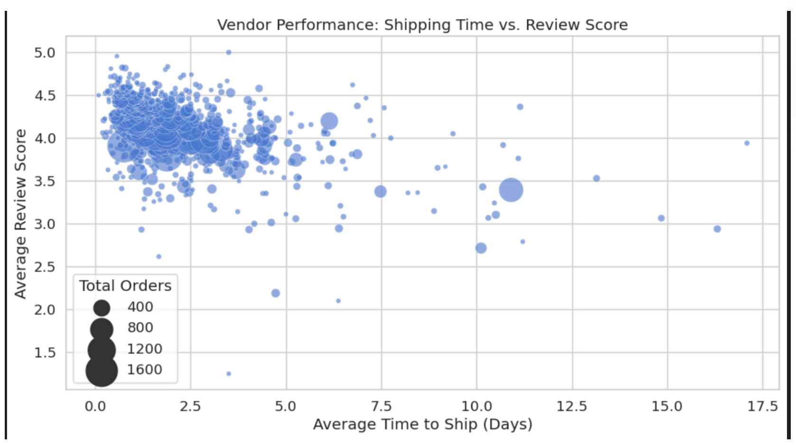
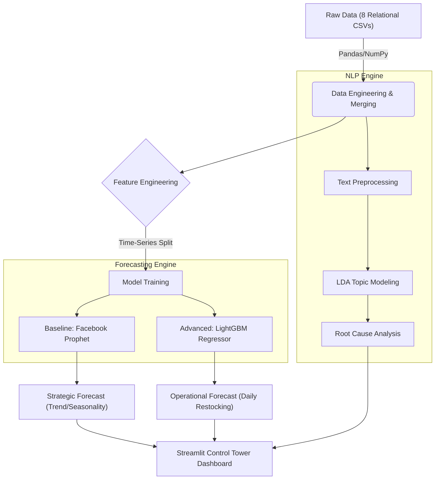
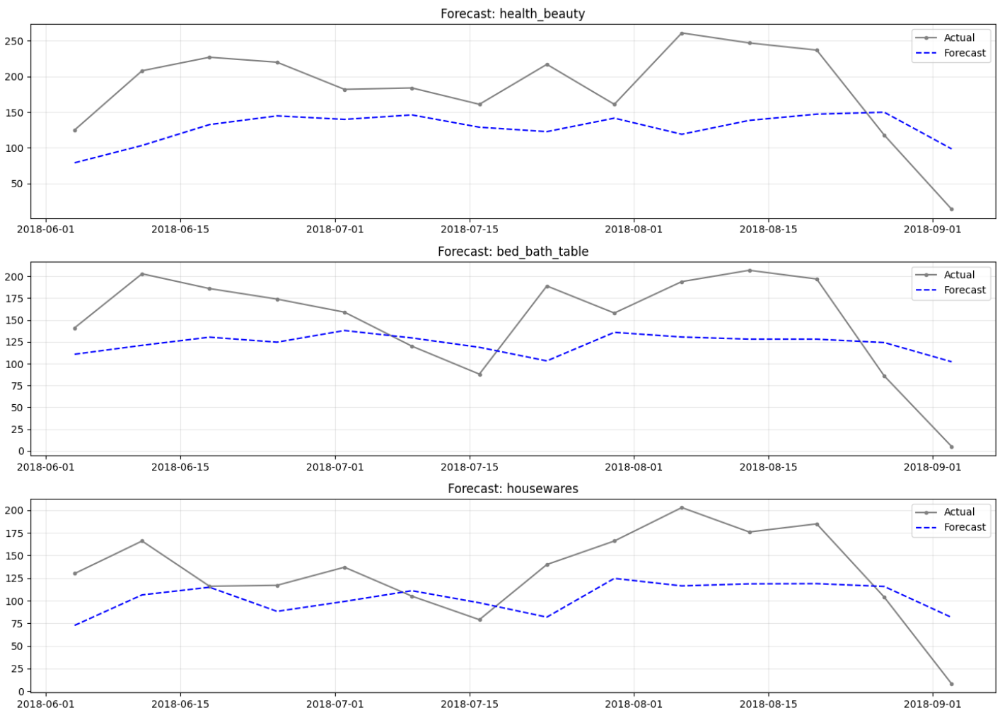
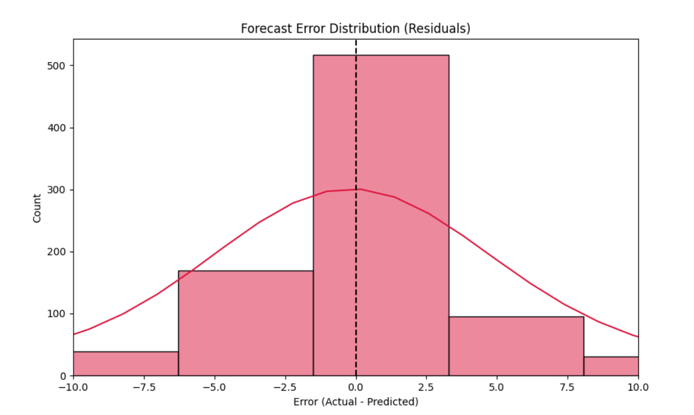

# Olist Supply Chain Control Tower: End-to-End Data Science Solution


## 📌 Executive Summary
**The Business Problem:** Olist, a major Brazilian e-commerce marketplace, faced operational bottlenecks hindering its growth. The primary challenges included inventory mismanagement (stock-outs vs. overstocking), unpredictable carrier delivery times, and a lack of data-driven visibility into vendor performance.

**The Solution:** I engineered an end-to-end "Supply Chain Control Tower" to transform these raw operational data points into actionable strategic insights. By integrating Logistics Optimization, Vendor Risk Scoring, and AI-powered Demand Forecasting, this system shifts the business focus from reactive firefighting to proactive planning.

**Key Outcomes:**
* **Optimized Logistics:** Identified that 80% of delivery delays stem from the carrier network rather than seller processing, redirecting optimization efforts to the "Last Mile."
* **Reduced Risk:** Built a vendor scoring engine that flags high-volume, slow-shipping sellers who negatively impact the platform's Net Promoter Score (NPS).
* **Improved Forecasting:** Deployed a hybrid ML model (LightGBM) that outperformed traditional baselines by significant margins in high-volatility categories.

---
## 💾 About the Dataset
This project relies on the **Brazilian E-Commerce Public Dataset by Olist**, representing real commercial data from **100k orders** made at multiple marketplaces in Brazil between 2016 and 2018.

* **Source:** [Kaggle: Olist Brazilian E-Commerce Dataset](https://www.kaggle.com/datasets/olistbr/brazilian-ecommerce)
* **Scale:** 100,000+ orders, 99,000+ customers, and 30,000+ distinct products.
* **Data Structure:** The data is organized in a complex **relational schema** consisting of 8 interconnected tables (Orders, Customers, Payments, Reviews, Items, Products, Sellers, and Geolocation).
* **Processing:** Required extensive SQL-style merging (left/inner joins) and preprocessing to handle real-world anomalies, including anonymized customer data and replacement of partner names with "Game of Thrones" references.
---

### 📉 System Preview
*Below is the output of the baseline forecasting engine, providing stakeholders with a 90-day visibility window into future demand trends and uncertainty intervals.*


---

## 🚀 Key Features & Strategic Insights

### 1. Logistics Optimization ("The Last Mile")
* **The Discovery:** Analysis revealed that while sellers process orders in **~2.4 days**, carriers take **~9.7 days** for delivery.
* **The Impact:** Identified that optimization efforts must target the carrier network rather than seller operations.
* [cite_start]**Geospatial Analysis:** Highlighted extreme disparities, with remote states like Roraima (RR) averaging **25+ days** for delivery compared to **~8 days** in São Paulo[cite: 48].

### 2. Vendor Performance Scoring
I developed a vendor scoring system to quantify the impact of logistics on brand reputation.
* **Correlation:** Discovered a strong negative correlation between shipping time and review scores.
* **Risk Management:** The system flags high-volume, slow-shipping vendors who disproportionately damage the platform's NPS (Net Promoter Score).


*Figure 2: Vendor Segmentation. The scatter plot reveals a clear cluster of underperforming vendors (bottom right) who combine high volume with slow shipping speeds.*

### 3. NLP Customer Sentiment Analysis
To understand *why* customers churn, I moved beyond simple star ratings and applied **Latent Dirichlet Allocation (LDA)** to over 10,000 text reviews.
* **Root Cause Analysis:** "Office Furniture" and "Fashion" were identified as high-risk categories.
* **Actionable Findings:** Topic modeling revealed specific recurring complaints: *"Product Assembly/Missing Parts"* and *"Color Mismatch"*, enabling the Category Management team to address specific quality control issues.


*Figure 3: Dissatisfaction Rate by Category. This analysis isolates product categories with systemic quality issues, prioritizing them for intervention.*

---

## 🛠️ Technical Architecture & Workflow

The solution is built on a modular pipeline designed for scalability and reproducibility.


---

### 🧠 Machine Learning Methodology

#### 1. The Dual-Model Strategy
A "one-size-fits-all" model is rarely optimal. I implemented a hybrid approach to balance interpretability with accuracy:
* **Facebook Prophet (The "Glass Box"):** Used for strategic planning. It automatically decomposes sales into intuitive components (trend, weekly seasonality, yearly seasonality) that business stakeholders can easily understand.
* **LightGBM (The "Black Box"):** Used for operational automation. A Gradient Boosting Machine that leverages extensive feature engineering (lag features, rolling windows, day-of-week encoding) to capture complex, non-linear interactions.

#### 2. Rigorous Validation (Preventing Overfitting)
Standard random train-test splits are invalid for time-series data due to data leakage. I employed **Time-Series Cross-Validation**, creating multiple "folds" where the model is trained on past data and validated on a strictly future block.

---

## 📊 Performance & Results

The advanced LightGBM model demonstrated superior performance in high-volume, volatile categories, proving the value of custom feature engineering over off-the-shelf solutions.

| Metric | Facebook Prophet (Baseline) | LightGBM (Advanced) |
| :--- | :--- | :--- |
| **Role** | Strategic Communication | Automated Replenishment |
| **Key Advantage** | Explains *why* demand is changing | Maximizes accuracy for *how much* to stock |
| **Bed_Bath_Table Error** | ~41% WMAPE | **~32% WMAPE** (Significant Improvement) |
| **Comp_Accessories Error**| ~71% WMAPE | **~40% WMAPE** (Significant Improvement) |

> **Strategic Decision:** The final "Control Tower" routes the Prophet output to the Executive Dashboard for monthly planning, while the LightGBM output feeds the daily Inventory Management System.

### Model Validation & Error Analysis
The charts below demonstrate the model's reliability on unseen data.


*Figure 4: Out-of-Sample Validation. The LightGBM model (Blue Dashed Line) accurately tracks actual demand (Grey Line) across key categories, capturing distinct seasonal patterns in 'Health & Beauty' vs. 'Bed Bath & Table'.*


*Figure 5: Error Distribution (Residuals). The residuals follow a near-normal distribution centered around zero, indicating that the model is unbiased and mathematically sound.*

---

## 📂 Project Structure

The directory is organized to separate data processing, modeling experiments, and the production application.

```bash
olist_supply_chain_analysis/
├── Data/                   # Raw and processed datasets (8 relational CSVs)
├── mlruns/                 # MLflow tracking artifacts for model experiments
├── models/                 # Serialized models (Prophet & LightGBM .pkl files)
├── notebooks/              # Jupyter notebooks for EDA and feature engineering
├── reports/                # PDF Project Report and analysis documentation
├── src/                    # Source code for ETL pipelines and helper functions
├── main.py                 # Entry point for the Streamlit Control Tower Dashboard
└── requirements.txt        # Python dependencies
```
----

## 💻 Installation & Usage

To replicate the analysis or run the dashboard locally:

1.  **Clone the repository:**
    ```bash
    git clone [https://github.com/Lavinasonp/olist_supplychain_analysis.git]
    cd olist_supply_chain_analysis
    ```

2.  **Create a virtual environment (Recommended):**
    ```bash
    python -m venv .venv
    source .venv/bin/activate  # On Windows use: .venv\Scripts\activate
    ```

3.  **Install dependencies:**
    ```bash
    pip install -r requirements.txt
    ```

4.  **Launch the Control Tower Dashboard:**
    ```bash
    streamlit run main.py
    ```
---

---

## 📌 Project Status

This project is complete and stable.  
All core components have been implemented, validated, and structured for future extension or production deployment.

---

## 📈 Future Enhancements

- Real-time data ingestion and streaming forecasts  
- Automated model retraining and monitoring  
- Cost-aware inventory and logistics optimization  
- Cloud-native deployment and orchestration  

---

## 📬 Notes

Results are based on historical data and may vary with different configurations or datasets.  
The codebase is designed for reproducibility and scalability.

---


